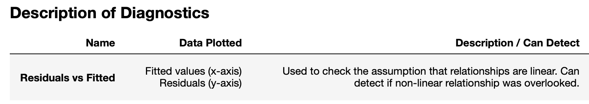
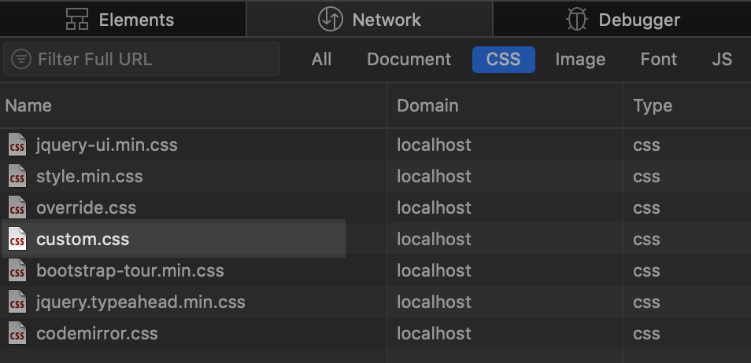
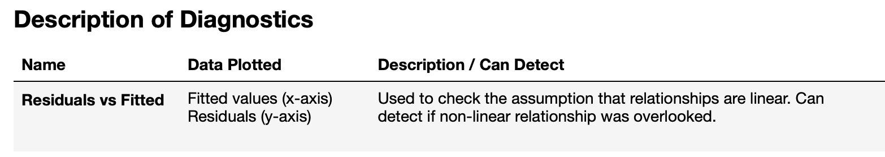

<h1 class="h4">The Problem</h1>

While working in a Jupyter Notebook, some HTML elements in a Markdown cell do not have the desired format.  More specifically, the table header and cells would not left-align with the following Markdown:


| Name | Data Plotted | Description / Can Detect
|:---|:---|:---
| cell1 text | cell2 text | cell3 text 


<div class="mb-4">
	
</div>


<h1 class="h4">The Solution</h1>

Find the correct custom.css file and edit to include the necessary CSS.  To find the correct CSS file, use the browser Developer Tools (the Network tab) with the Jupyter Notebook page to see which CSS file is being loaded and then use the operating system's file search to find the location of the file.  
<div class="mb-4">
	
</div>

For me, the file was located at:

```
/anaconda3/envs/{environment name}/lib/python3.7/site-packages/notebook/static/custom
```

The custom.css file located there needed styling for <b>th</b> and <b>td</b> tags:

```
th, td {
	text-align:  left !important;
	vertical-align: top !important;
}
```

And this is the result (left-aligned headers and cells):
<div class="mb-4">
	
</div>

<h1 class="h4">The Gotchas</h1>
This method has some limitations.  Be sure to test your different usage situations, especially if the notebook needs to run on multiple computers or needs to be exported to a different format.  